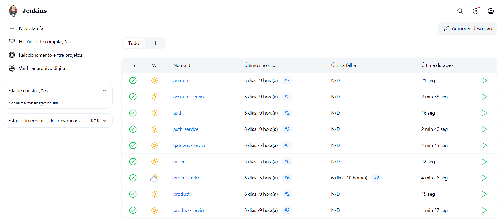

# Team Project

## Configuração AWS

A AWS é uma plataforma de computação em nuvem que oferece uma ampla gama de serviços, incluindo computação, armazenamento, banco de dados, análise, rede, mobilidade, ferramentas de desenvolvedor, gerenciamento e segurança.

Para configurar a AWS, foi criado um usuário com *AdministradorAcess* chamado *platform*.


## Configuração EKS

O Amazon Elastic Kubernetes Service (EKS) é um serviço gerenciado que facilita a execução do Kubernetes na AWS sem a necessidade de instalar e operar seu próprio plano de controle ou nós de trabalho do Kubernetes. O EKS cuida da alta disponibilidade e escalabilidade do plano de controle do Kubernetes, permitindo que você se concentre em implantar e gerenciar seus aplicativos.

Para isso, criamos um EKS Cluster.


## Testes de Carga 

Os testes de carga são uma parte importante do desenvolvimento de software, pois ajudam a garantir que sua aplicação possa lidar com o tráfego esperado. 

<iframe width="100%" height="470" src="https://www.youtube.com/watch?v=j4Ju5vX0feI" allowfullscreen></iframe>

## CI/CD

A integração contínua (CI) e a entrega contínua (CD) são práticas de desenvolvimento de software que ajudam a garantir que seu código esteja sempre em um estado implantável. Utilizamos o Jenkins para implementá-las. 



Para isso, foi realizado uma série de etapas para a configuração do Jenkins:

1. Instalação do MiniKube;
1. Instalação do AWS CLI;
1. Configurar o kube-config para apontar para o cluster remoto AWS EKS.

Além disso, cada um dos microsserviços possuem um arquivo Jenkinsfile na raiz do projeto, como abaixo:

``` { .bash }
.
├── account-service
│   ├── Jenkinsfile
│   └── ...
```

O código-fonte do arquivo Jekinsfile pode ser visto abaixo:

=== "Interface"
    ``` { .java .copy .select linenums="1" }
    --8<-- "https://raw.githubusercontent.com/giuvallente/account/main/Jenkinsfile"
    ```

=== "Implementação"
    ``` { .groovy .copy .select linenums="1" }
    --8<-- "https://raw.githubusercontent.com/giuvallente/account-service/main/Jenkinsfile"
    ```

## Análise de Custo

A análise de custos é uma parte importante do desenvolvimento de software, já que ajuda a garantir que o projeto esteja dentro do orçamento.

[Análise de Custo](https://calculator.aws/#/estimate?id=ebffd68db3ee23493c3bcef702142e42c0e0db76)

## PaaS

Com o modelo de Plataforma como Serviço (PaaS), é possível executar e gerenciar aplicações sem a complexidade de construir e manter toda a infraestrutura necessária para o seu funcionamento. No nosso projeto, utilizamos a AWS com o serviço de Amazon EKS (Elastic Kubernetes Service), o que nos permitiu executar containers em escala sem precisar provisionar e gerenciar manualmente servidores ou clusters de máquinas.

Essa abordagem nos proporcionou diversos benefícios:

	- Foco total no desenvolvimento da aplicação, sem precisar lidar com a configuração e manutenção de servidores.
	- Automação de deploys e escalabilidade, permitindo que a aplicação se adapte automaticamente à demanda.
	- Maior produtividade, já que o gerenciamento de infraestrutura, atualizações e disponibilidade é feito pela própria plataforma.

Além disso, nossa visão para o futuro é evoluir a aplicação para um modelo completo de PaaS, no qual poderemos oferecer nosso sistema como serviço diretamente para os usuários. Dessa forma, nossos clientes não precisarão se preocupar com a infraestrutura ou instalação do sistema, bastando acessá-lo pela internet, como ocorre com plataformas SaaS (Software como Serviço).
